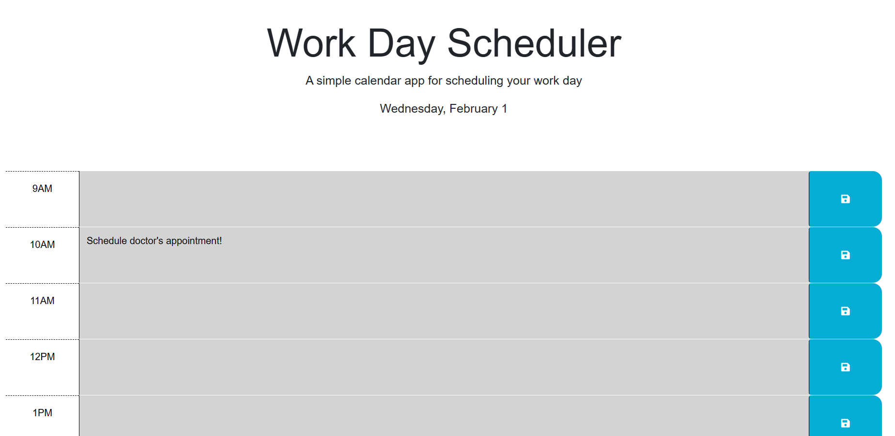

## Name
Work Day Scheduler 
## Description
Use this scheduler to save events for each hour and get an up-to-date view of the current, past, and present hour. This program uses Dayjs to pull and compare to your current time zones. 

## Visuals
Here is an Screenshot of the Work Day Scheduler!

## Roadmap
If you have ideas for releases in the future, it is a good idea to list them in the README.

## Contributing
Thank you to DU Coding Bootcamp for the starter code. 
Collaborated with Johnny McGrown

## Link
Here is the link to access the website! [reinerkp.github.io/WorkDayScheduler](https://reinerkp.github.io/WorkDayScheduler/)

